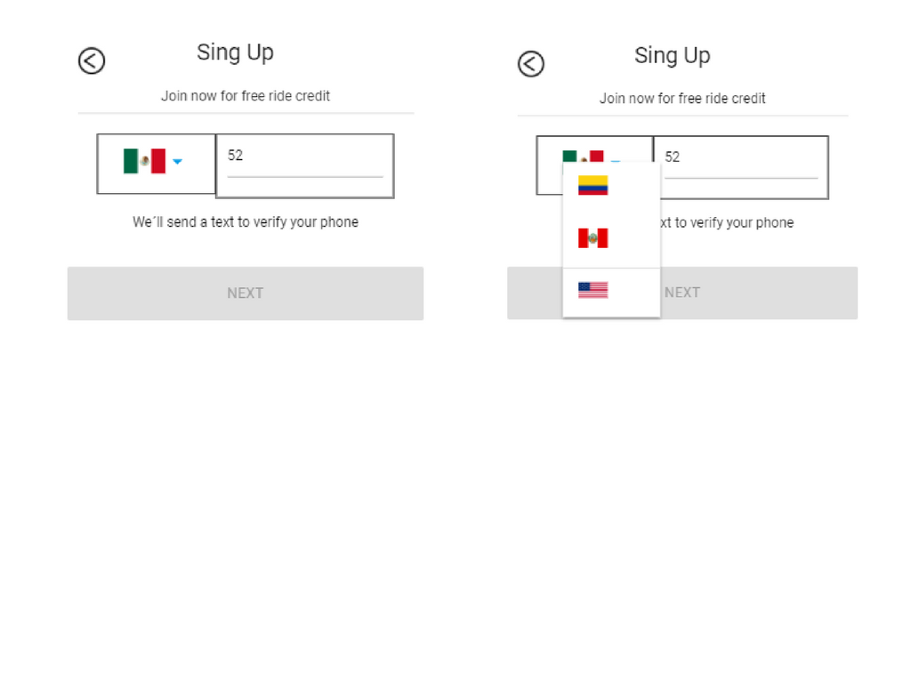
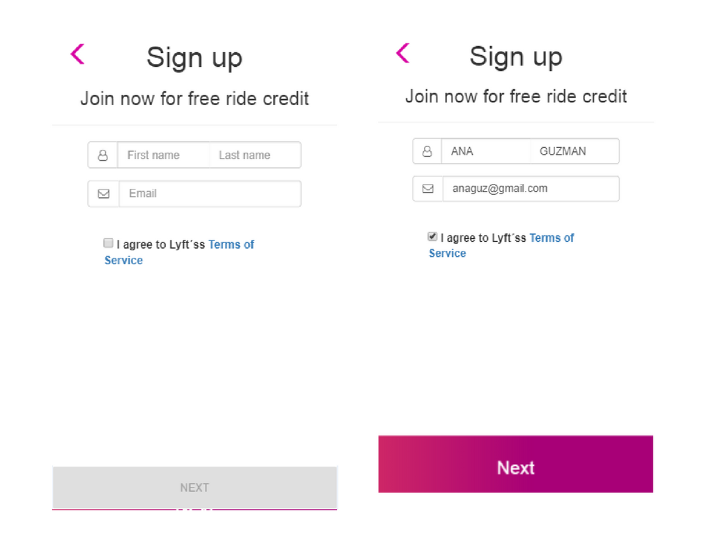

# LYFT

* **Track:** _Common Core_
* **Curso:** _Crea tu propia red social_
* **Unidad 3:** _Agiliza tu desarrollo_

## Objetivo

Desarrollar una web-app que replique el sitio de **Lyft**, en este reto deberás cumplir los pasos necesarios para que tu usuario pueda registrarse.

## Alumna

* Maria Cristina Ortiz Villafuerte.

## Descripción

Se muestra la web-app **LYFT**. La web-app esta adaptada para diseño mobile. Se utilizÓ las herramientas: BOOTSTRAP, jQuery, HTML5, CSS3.

La web-app contiene:

* La **VISTA SPLASH** que dura 5 segundos.

* La **VISTA DE INICIO** que contiene los  **botones sign up y log in** para registrarse si no tiene cuenta o iniciar sesión.

* La **VISTA SIGN UP** que contiene:

     * **button dropdown** para filtrar el pais.

     * **Un input** para ingresar el número de telefono.

     * **button next** que se activa cuando el número de telefono es ingresado(>= 10 dígitos) para ingresar a la vista verifyphone.

* La **VISTA VERIFY PHONE** que contiene:

     * **Input** para ingresar el codigo (LAB-000) brindado en la vista sign up.

     * **button next** que se activa cuando el código es ingresado, dirige a la vista register.

* La **VISTA REGISTER** que contiene:

    * **Inputs** para ingresar el nombre y apellido, correo electronico, password.

    * **button Sign Up** que se activa cuando los inputs esta validados.

* La **VISTA FINAL** que muestra un check de registro exitoso que dura 5 segundos y regresa a la vista de inicio.

## EStructuras de guía

